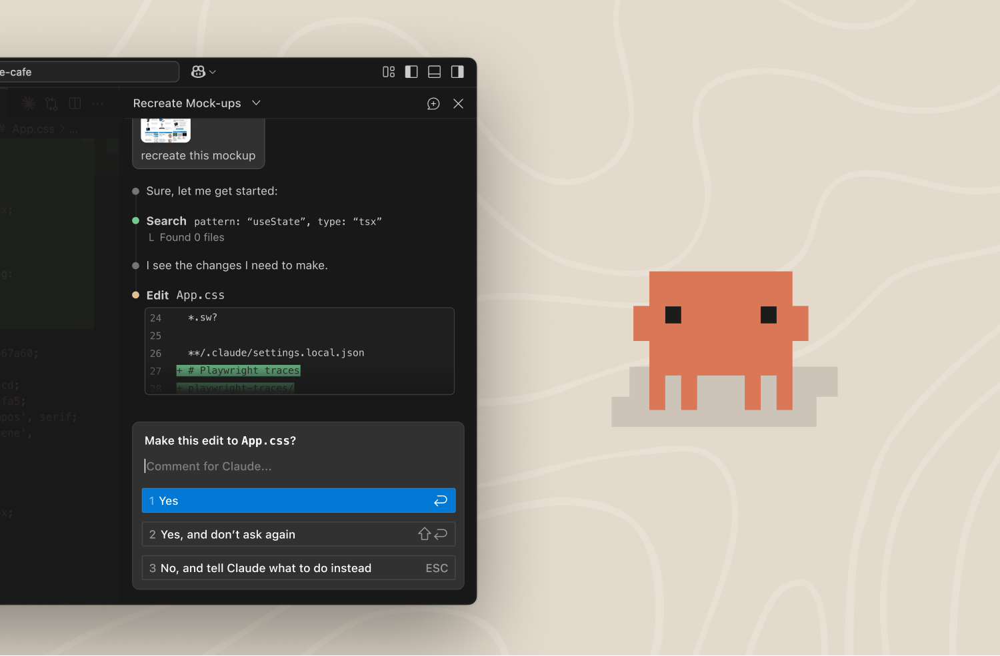

**Claude Code helps you write, edit, and understand code right in VS Code.**

Claude can read your files, make edits, run terminal commands, and help you navigate complex codebases. It understands context and works alongside you like a knowledgeable teammate.

Prefer a terminal experience? Run **Claude Code: Open in Terminal** from the Command Palette, or enable it permanently in Settings.
