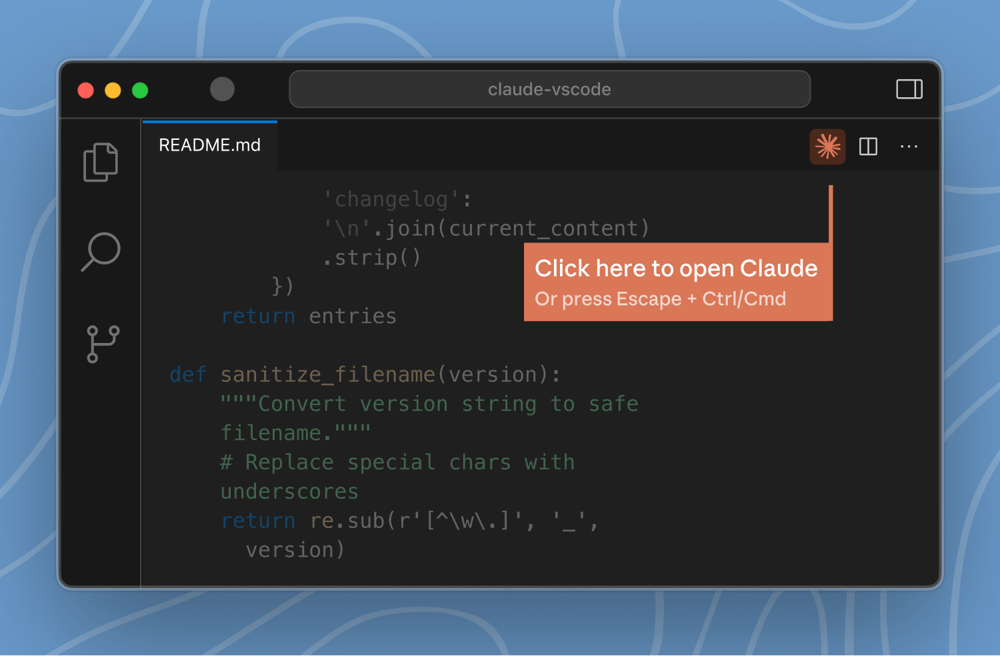

**Click the orange Claude icon in the top right corner of your editor.**

You can also use the keyboard shortcut **Ctrl+Escape** (Windows/Linux) or **Cmd+Escape** (Mac) to quickly open or focus Claude Code.
